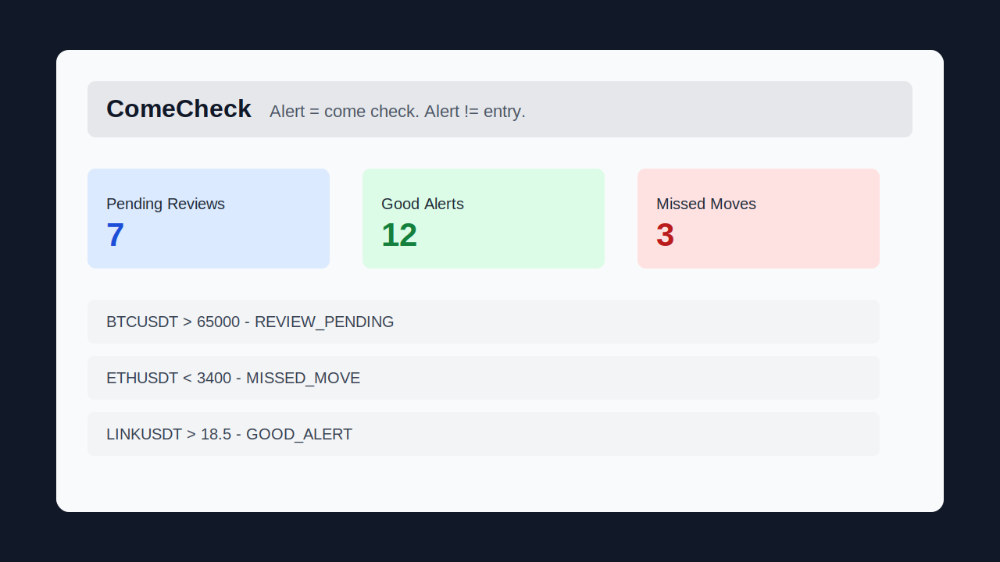

# ComeCheck

A tiny **local-first alert replay journal** for discretionary traders and market researchers.

**Alert = come check. Alert != entry.**



## Core Idea

Most trading journals start *after* a trade.

**ComeCheck starts *after* an alert.**

### One Question

Did this alert actually matter?

## What It Does

- **Record alerts**: asset, level, direction, alert_type, trigger_time, price_at_trigger, tags, notes
- **Review pending alerts**: Was I available? What happened after? Was it a good setup?
- **Track verdicts**: GOOD_ALERT, FALSE_ALERT, MISSED_MOVE, FAILED_SETUP, CLOSED
- **Dashboard**: Quick view of alert statistics and pending review queue
- **Export**: Selected alerts as Markdown for further analysis

## Example Workflow

ComeCheck follows one simple loop. Here's how a single alert moves through it:

1. **Alert fired** — An alert triggers (e.g. BTC/USD touches your 42,500 support level). You record it in the **Add Alert** tab: asset, level, direction, alert type, trigger time, price at trigger, plus any tags or notes. The alert starts with the verdict `PENDING_REVIEW`.
2. **Review pending** — Later, you open the **Review Queue** tab and pick the pending alert. First question: *was I even available when it fired?*
3. **Chart replay** — You pull up your own chart for that asset and time, and replay what the market actually did after the alert. (ComeCheck doesn't fetch charts — you bring your own.)
4. **Fact** — You write down what objectively happened in **What Happened After** (e.g. "bounced 1.5% then faded back below the level").
5. **Verdict** — Based on the replay, you assign a verdict: `GOOD_ALERT`, `FALSE_ALERT`, `MISSED_MOVE`, `FAILED_SETUP`, or `CLOSED`.
6. **Rule update** — Finally, you capture what you learned in **Lesson** and, if it changes how you'll act next time, a **Rule Update** (e.g. "review support bounces with and without volume separately next time").

```
alert fired → review pending → chart replay → fact → verdict → rule update
```

Over time, this loop turns a stream of noisy alerts into a record of which alerts actually mattered — and why.

## What It Does NOT Do

- Generate trading signals
- Place orders or connect to exchanges
- Provide financial advice
- Store API keys or credentials
- Integrate with brokers
- Use AI for trade analysis
- Connect to Telegram or external services
- Require authentication or cloud storage

## Stack

- **Python 3.10+**
- **Streamlit** – simple local web interface
- **JSONL** – local file storage (data/alerts.jsonl)

## Installation & Usage

```bash
# Clone repo
git clone https://github.com/DrDzekiL/comecheck.git
cd comecheck

# Install dependencies
pip install -r requirements.txt

# Run
streamlit run app.py
```

Then open `http://localhost:8501` in your browser.

## Project Structure

```
comecheck/
├── README.md              # This file
├── ROADMAP.md             # Project direction and non-goals
├── CONTRIBUTING.md        # Local setup and contribution boundaries
├── requirements.txt       # Python dependencies
├── app.py                 # Streamlit app
├── LICENSE                # MIT
├── .gitignore
├── assets/
│   └── screenshot-placeholder.svg
├── data/
│   └── .gitkeep           # Keeps data/ in Git; alerts.jsonl is ignored
└── examples/
    └── sample_alerts.jsonl # Sample data for reference
```

`data/alerts.jsonl` is created locally by the app and ignored by Git so user
journals do not get committed accidentally.

## Alert Schema

```json
{
  "id": "uuid-here",
  "asset": "BTC/USD",
  "level": 42500.0,
  "direction": "UP",
  "alert_type": "SUPPORT_BOUNCE",
  "trigger_time": "2025-06-13T14:30:00Z",
  "price_at_trigger": 42520.0,
  "tags": ["breakout", "daily"],
  "notes": "Strong rejection at 42k support",
  "was_user_available": null,
  "what_happened_after": null,
  "verdict": "PENDING_REVIEW",
  "lesson": null,
  "rule_update": null,
  "created_at": "2025-06-13T14:35:00Z",
  "updated_at": "2025-06-13T14:35:00Z"
}
```

## Verdicts

- **PENDING_REVIEW**: Initial/default state for a newly recorded alert, before it has been reviewed
- **GOOD_ALERT**: Signal was valid, user was available, setup worked as expected
- **FALSE_ALERT**: Alert triggered but context was wrong or invalidated quickly
- **MISSED_MOVE**: Alert was valid but you weren't paying attention
- **FAILED_SETUP**: Setup looked good but invalidated, trade moved against prediction
- **CLOSED**: Not a trade opportunity, just noting market structure

## License

MIT License. See [LICENSE](LICENSE) for details.

## Philosophy

ComeCheck exists to answer one simple question for traders: *Did this alert matter?*

Not every alert becomes a trade. Not every trade is an alert. 
ComeCheck bridges that gap.

It's boring. It's local. It's useful.

---

**This is not financial advice.**
**ComeCheck does not generate trading signals.**
**ComeCheck does not place orders.**
**ComeCheck does not connect to exchanges.**
**ComeCheck is a personal learning/review journal.**
